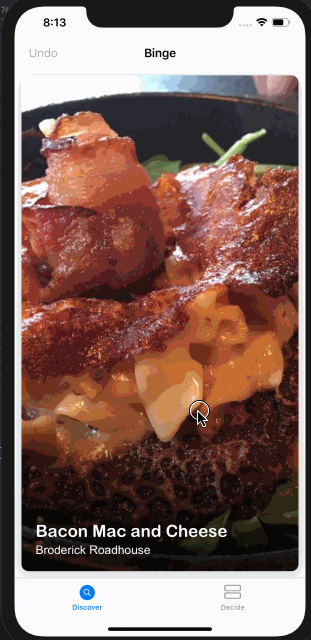
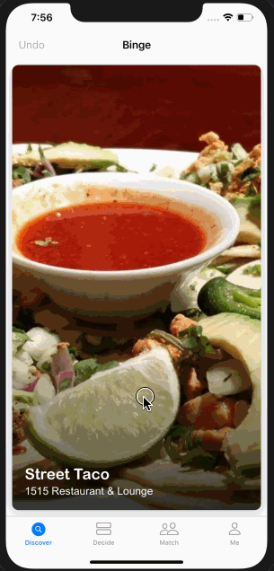

# Binge-iOS
A dating app for food

### Evolution

### Backend
https://github.com/wfgilman/binge

### Features
* Unauthenticated experience (no sign-up)
  - User swipes right to add dish to likes tab
  - User swipes up to call, view Instagram, view address, or open Doordash app for dish
  - User likes expire after six hours for repeat usage
  - User can discard liked dishes from likes tab
* Authenticated experience: unauthenticated experience **plus**
  - User creates account in-app using SMS verification code
  - User can invite multiple friends to "dine" with
  - User can select a friend to match with
  - Dish or restaurant matches are visually displayed while swiping
  - Common dishes or common restaurants liked appear in the matches tab
  - Users with app in background receive push notifiation when friend matches on a dish or restaurant
  - User can submit feedback
  - User can delete account

### Roadmap
- User can add categories to a Dish
- User can filter dishes by multiple categories
- User can order dish from likes tab
- User can initiate a bracket tournament from liked dishes to decide top selection

### Credits
- Shuffle https://github.com/mac-gallagher/Shuffle
- Codextended https://github.com/JohnSundell/Codextended
- Alamofire https://github.com/Alamofire/Alamofire
- Kingfisher https://github.com/onevcat/Kingfisher
- SwipeCellKit https://github.com/SwipeCellKit/SwipeCellKit
- HGPlaceholders https://github.com/HamzaGhazouani/HGPlaceholders
- AnimatedTextInput https://github.com/jobandtalent/AnimatedTextInput
- Eureka https://github.com/xmartlabs/Eureka
